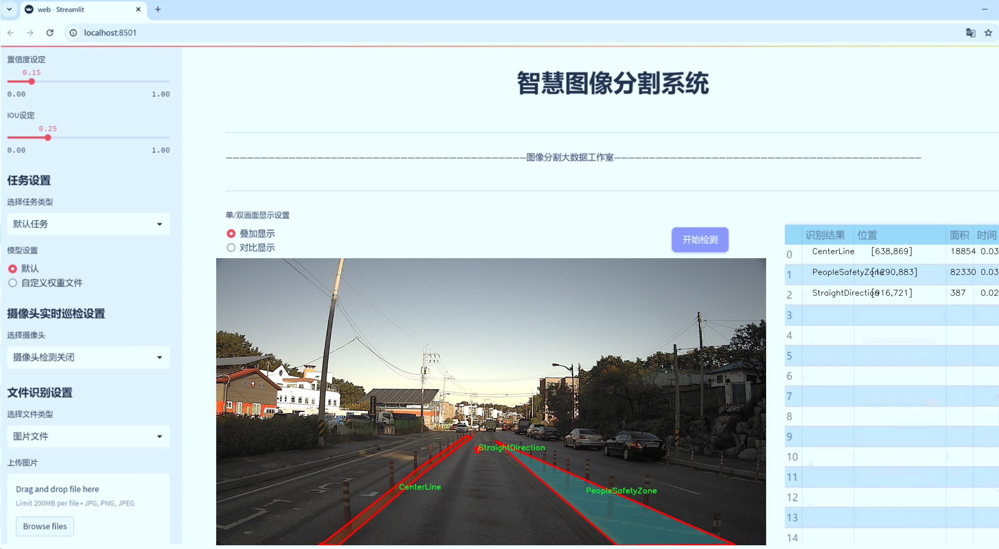
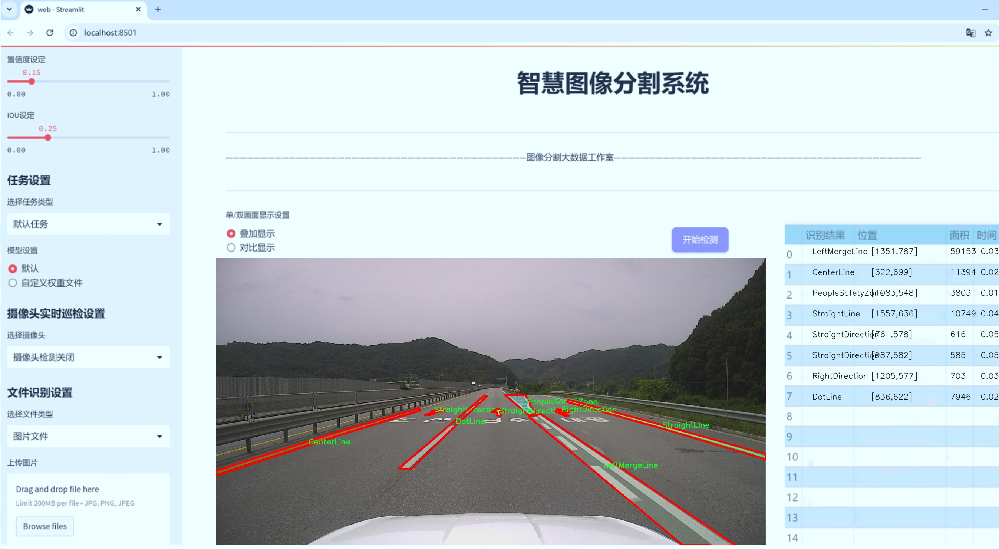
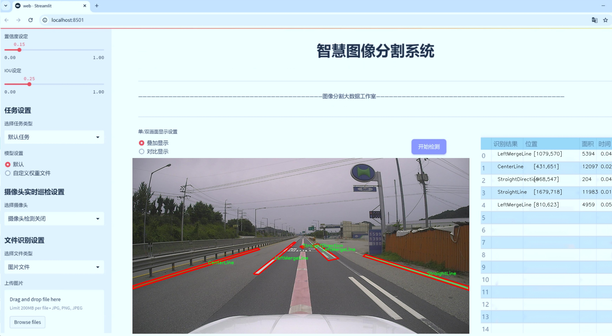
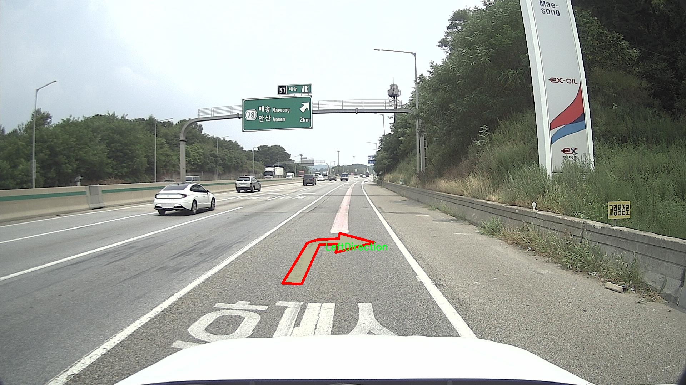
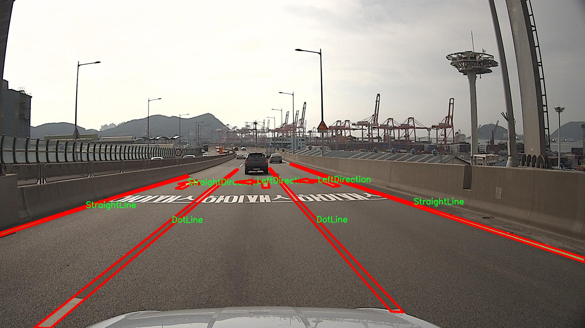
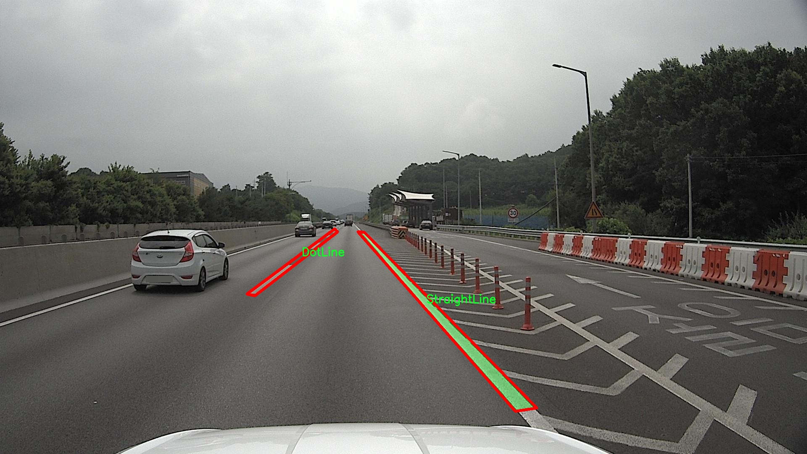
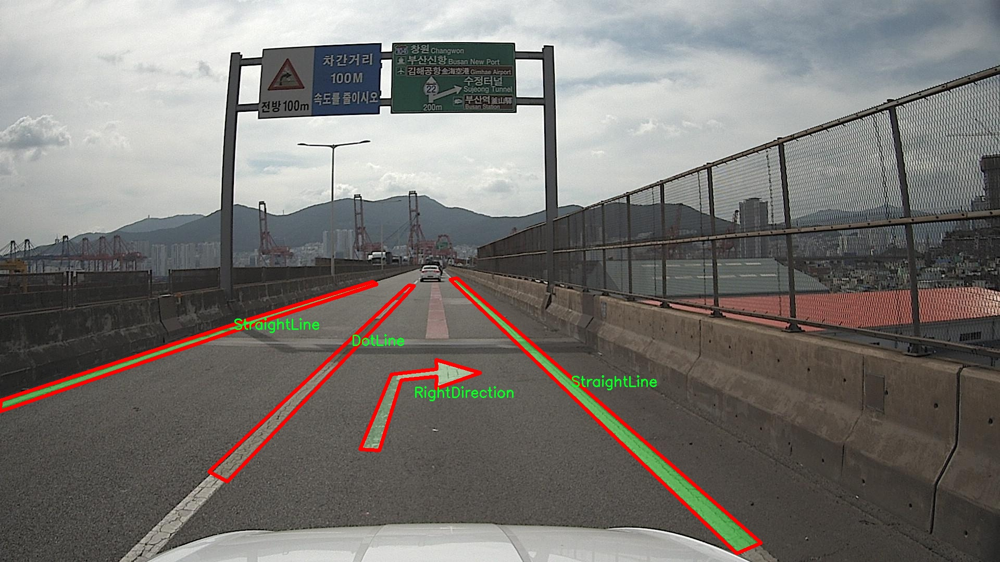
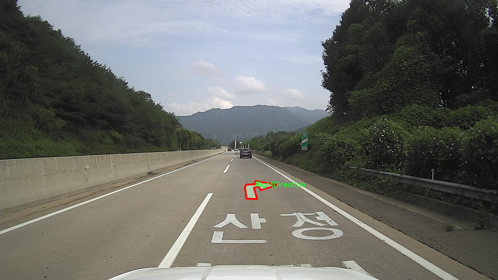

# 韩国道路标线分割系统源码＆数据集分享
 [yolov8-seg-C2f-Parc＆yolov8-seg-FocalModulation等50+全套改进创新点发刊_一键训练教程_Web前端展示]

### 1.研究背景与意义

项目参考[ILSVRC ImageNet Large Scale Visual Recognition Challenge](https://gitee.com/YOLOv8_YOLOv11_Segmentation_Studio/projects)

项目来源[AAAI Global Al lnnovation Contest](https://kdocs.cn/l/cszuIiCKVNis)

研究背景与意义

随着城市化进程的加快，交通管理与安全问题日益突出，尤其是在道路标线的识别与分割方面。道路标线作为交通管理的重要组成部分，直接影响着交通流畅性和行车安全。尤其是在韩国，复杂的交通环境和多样化的道路标线类型使得传统的人工识别方法难以满足实时性和准确性的要求。因此，基于深度学习的图像分割技术，尤其是改进的YOLOv8模型，成为了解决这一问题的有效手段。

YOLO（You Only Look Once）系列模型以其高效的实时目标检测能力而广受欢迎，近年来在实例分割领域也取得了显著进展。YOLOv8作为该系列的最新版本，具备更强的特征提取能力和更快的推理速度，适合处理复杂的道路标线场景。通过对YOLOv8模型的改进，能够更好地适应韩国特有的道路标线种类和布局，提升标线分割的准确性和鲁棒性。

本研究将利用“Roadmarkinglabeling 2”数据集，该数据集包含1800张图像，涵盖44种不同的道路标线类别，包括公交车道、停车区、中心线、施工区域、行人安全区等。这些类别不仅丰富了模型的训练数据，也为其在实际应用中的推广提供了良好的基础。通过对这些数据的深度学习训练，模型将能够识别和分割出不同类型的道路标线，从而为交通管理提供更为精准的数据支持。

在技术层面，改进YOLOv8模型的研究意义在于提升其在复杂场景下的分割精度和处理速度。传统的图像分割方法往往在处理高噪声和多变环境时表现不佳，而YOLOv8的多尺度特征融合和注意力机制能够有效应对这些挑战。此外，针对韩国道路标线的特殊性，研究将结合区域特征和上下文信息，进一步优化模型的性能。这不仅为道路标线的自动化识别提供了新的思路，也为其他城市的交通管理提供了借鉴。

从社会意义上看，基于改进YOLOv8的道路标线分割系统将极大提升交通安全性和管理效率。通过实现道路标线的自动识别与分割，交通管理部门能够实时监控道路状况，及时发现和处理交通隐患。同时，该系统还可为智能交通系统的建设提供数据支持，推动交通管理的智能化与自动化发展，提升城市交通的整体效率。

综上所述，基于改进YOLOv8的韩国道路标线分割系统的研究，不仅具有重要的学术价值，也为实际交通管理提供了切实可行的解决方案。通过深入探讨和实践，期望能够为未来的智能交通系统建设奠定坚实的基础，推动交通安全与管理的现代化进程。

### 2.图片演示







##### 注意：由于此博客编辑较早，上面“2.图片演示”和“3.视频演示”展示的系统图片或者视频可能为老版本，新版本在老版本的基础上升级如下：（实际效果以升级的新版本为准）

  （1）适配了YOLOV8的“目标检测”模型和“实例分割”模型，通过加载相应的权重（.pt）文件即可自适应加载模型。

  （2）支持“图片识别”、“视频识别”、“摄像头实时识别”三种识别模式。

  （3）支持“图片识别”、“视频识别”、“摄像头实时识别”三种识别结果保存导出，解决手动导出（容易卡顿出现爆内存）存在的问题，识别完自动保存结果并导出到tempDir中。

  （4）支持Web前端系统中的标题、背景图等自定义修改，后面提供修改教程。

  另外本项目提供训练的数据集和训练教程,暂不提供权重文件（best.pt）,需要您按照教程进行训练后实现图片演示和Web前端界面演示的效果。

### 3.视频演示

[3.1 视频演示](https://www.bilibili.com/video/BV118CUYfEQj/)

### 4.数据集信息展示

##### 4.1 本项目数据集详细数据（类别数＆类别名）

nc: 44
names: ['BusLine', 'Busstopzone', 'CenterLine', 'Colorcone', 'ConstructionZone', 'Constructionleftmergearrow', 'CrossWalk', 'DotLine', 'LeftDirection', 'LeftMergeLine', 'LeftandRight', 'LeftandUturn', 'Leftmergearrow', 'NoLeftTurn', 'NoRightTurn', 'NoStraight', 'Nouturn', 'OppositeSideLeft', 'OppositeSideUturn', 'OppositeTriangle', 'PeopleSafetyZone', 'RightDirection', 'RightMergeLine', 'Rightmergearrow', 'Roaddiamond', 'SpeedLimit50', 'Speedlimit30', 'Speedlimit40', 'Speedlimit50', 'Speedlimit80', 'Speedlimit90', 'StopLine', 'StraightDirection', 'StraightLeftRight', 'StraightLine', 'StraightandLeft', 'StraightandRight', 'SuddenlyDotLine', 'TurnDirection', 'TurnDotLine', 'Uturn', 'bikeroad', 'speedlimit60', 'speedlimit70']


##### 4.2 本项目数据集信息介绍

数据集信息展示

在本研究中，我们采用了名为“Roadmarkinglabeling 2”的数据集，以训练和改进YOLOv8-seg模型，旨在提升韩国道路标线的分割系统。该数据集包含44个类别，涵盖了各种道路标线和交通指示的细节，具有丰富的标注信息，能够为模型提供多样化的训练样本。这些类别的多样性不仅反映了韩国道路标线的复杂性，也为模型的学习提供了全面的视角。

具体而言，数据集中包含的类别包括但不限于：公交专用线（BusLine）、公交站区域（Busstopzone）、中心线（CenterLine）、颜色锥（Colorcone）、施工区域（ConstructionZone）等。这些类别在实际道路环境中具有重要的功能，帮助驾驶员和行人理解交通规则和道路使用情况。例如，公交专用线和公交站区域的标识能够有效引导公共交通的运行，而施工区域的标识则确保了行车安全，提醒驾驶员注意施工带来的潜在风险。

此外，数据集中还包括了多种交通指示，如左转、右转、直行等方向指示（LeftDirection、RightDirection、StraightDirection），以及各种限速标志（SpeedLimit50、Speedlimit30、Speedlimit40等）。这些信息对于自动驾驶系统和智能交通管理系统的开发至关重要，因为它们需要实时识别和解析道路标线，以确保行车安全和流畅。

值得注意的是，数据集中的类别如人行横道（CrossWalk）、人身安全区（PeopleSafetyZone）等，强调了行人安全的重要性。这些标线的准确识别不仅有助于提高驾驶员的警觉性，也为行人提供了更安全的过马路环境。此外，数据集中还包含了多种合并线（LeftMergeLine、RightMergeLine）和转向指示（TurnDirection、Uturn），这些标线在复杂的交通环境中尤为重要，能够有效引导车辆的行驶路径，减少交通事故的发生。

通过使用“Roadmarkinglabeling 2”数据集，我们的目标是训练出一个能够高效、准确地识别和分割各种道路标线的YOLOv8-seg模型。该模型不仅能够在静态图像中进行标线识别，还能够在动态场景中实时处理，从而为自动驾驶技术的应用提供强有力的支持。随着数据集的不断扩展和模型的持续优化，我们期望能够实现更高的识别精度和更快的处理速度，最终推动智能交通系统的发展。

总之，“Roadmarkinglabeling 2”数据集为我们提供了一个丰富的基础，以支持对韩国道路标线的深入研究和分析。通过充分利用这一数据集，我们希望能够在道路标线分割领域取得突破，为未来的智能交通解决方案奠定坚实的基础。











### 5.全套项目环境部署视频教程（零基础手把手教学）

[5.1 环境部署教程链接（零基础手把手教学）](https://www.bilibili.com/video/BV1jG4Ve4E9t/?vd_source=bc9aec86d164b67a7004b996143742dc)


[5.2 安装Python虚拟环境创建和依赖库安装视频教程链接（零基础手把手教学）](https://www.bilibili.com/video/BV1nA4VeYEze/?vd_source=bc9aec86d164b67a7004b996143742dc)

### 6.手把手YOLOV8-seg训练视频教程（零基础小白有手就能学会）

[6.1 手把手YOLOV8-seg训练视频教程（零基础小白有手就能学会）](https://www.bilibili.com/video/BV1cA4VeYETe/?vd_source=bc9aec86d164b67a7004b996143742dc)


按照上面的训练视频教程链接加载项目提供的数据集，运行train.py即可开始训练



     Epoch   gpu_mem       box       obj       cls    labels  img_size
     1/200     0G   0.01576   0.01955  0.007536        22      1280: 100%|██████████| 849/849 [14:42<00:00,  1.04s/it]
               Class     Images     Labels          P          R     mAP@.5 mAP@.5:.95: 100%|██████████| 213/213 [01:14<00:00,  2.87it/s]
                 all       3395      17314      0.994      0.957      0.0957      0.0843

     Epoch   gpu_mem       box       obj       cls    labels  img_size
     2/200     0G   0.01578   0.01923  0.007006        22      1280: 100%|██████████| 849/849 [14:44<00:00,  1.04s/it]
               Class     Images     Labels          P          R     mAP@.5 mAP@.5:.95: 100%|██████████| 213/213 [01:12<00:00,  2.95it/s]
                 all       3395      17314      0.996      0.956      0.0957      0.0845

     Epoch   gpu_mem       box       obj       cls    labels  img_size
     3/200     0G   0.01561    0.0191  0.006895        27      1280: 100%|██████████| 849/849 [10:56<00:00,  1.29it/s]
               Class     Images     Labels          P          R     mAP@.5 mAP@.5:.95: 100%|███████   | 187/213 [00:52<00:00,  4.04it/s]
                 all       3395      17314      0.996      0.957      0.0957      0.0845


### 7.50+种全套YOLOV8-seg创新点代码加载调参视频教程（一键加载写好的改进模型的配置文件）

[7.1 50+种全套YOLOV8-seg创新点代码加载调参视频教程（一键加载写好的改进模型的配置文件）](https://www.bilibili.com/video/BV1Hw4VePEXv/?vd_source=bc9aec86d164b67a7004b996143742dc)

### 8.YOLOV8-seg图像分割算法原理

原始YOLOv8-seg算法原理

YOLOv8-seg算法是YOLO系列中的最新版本，代表了目标检测和图像分割领域的一个重要进步。作为一种单阶段检测算法，YOLOv8在检测精度和速度方面均表现出色，得益于其精心设计的网络结构和优化策略。该算法的核心构成包括输入层、Backbone骨干网络、Neck特征融合网络和Head检测模块四个主要部分，每一部分都经过深思熟虑的设计，以确保算法的高效性和准确性。

在输入层，YOLOv8-seg算法首先对输入图像进行预处理，包括调整图像比例、应用Mosaic增强和进行瞄点计算。Mosaic增强技术通过将多张图像拼接在一起，增加了训练数据的多样性，从而提高了模型的鲁棒性和泛化能力。然而，YOLOv8在训练的最后阶段停止使用Mosaic增强，以避免对数据真实分布的破坏，确保模型学习到更为有效的信息。

YOLOv8的Backbone网络沿用了DarkNet结构，但进行了重要的改进。特别是，YOLOv8用C2f模块替换了C3模块，C2f模块通过引入更多的跳层连接，增强了梯度流动信息的丰富性，同时保持了网络的轻量化特性。这种设计不仅提高了特征提取的效率，还使得模型在处理不同尺度的目标时更加灵活。此外，SPPF模块的引入，通过不同内核尺寸的池化操作，对特征图进行有效合并，进一步提升了特征提取的质量。

在Neck部分，YOLOv8采用了“双塔结构”，结合了特征金字塔和路径聚合网络。这种结构促进了语义特征和定位特征之间的有效转移，增强了网络对不同尺度目标的检测能力。特征金字塔的设计使得模型能够在多个尺度上进行特征提取，而路径聚合网络则通过多层次的信息融合，确保了模型对复杂场景的适应性。

YOLOv8的Head检测模块采用了解耦头的结构，将回归分支和预测分支分离，分别处理目标的分类和定位任务。这种分离的设计使得模型在进行目标检测时，能够更专注于各自的任务，从而加速了模型的收敛速度并提高了预测精度。特别是在边界框的定位上，YOLOv8引入了无锚框结构，直接预测目标的中心位置，并通过任务对齐学习（Task Alignment Learning）来优化分类和定位的效果。这种方法通过引入分类分数和IOU的高次幂乘积，增强了模型在分类和定位任务中的表现。

在损失函数的设计上，YOLOv8采用了新的损失策略，包括变焦损失、数据平均保真度损失和完美交并比损失。这些损失函数的设计使得模型在训练过程中能够更加准确地进行目标检测，尤其是在复杂场景中，提高了模型的鲁棒性和准确性。

值得注意的是，YOLOv8-seg不仅在目标检测方面表现优异，还扩展了图像分割的能力。通过对特征图的进一步处理，YOLOv8-seg能够实现对图像中目标的精确分割，提供更为细致的目标信息。这一能力在实际应用中具有重要意义，尤其是在需要对目标进行精细化处理的场景中，如医学影像分析、自动驾驶等领域。

总的来说，YOLOv8-seg算法通过一系列的结构优化和策略改进，实现了在目标检测和图像分割任务中的高效性和准确性。其创新的网络结构、灵活的特征融合方式以及高效的损失计算策略，使得YOLOv8-seg在众多目标检测算法中脱颖而出，成为当前研究和应用的热点。随着技术的不断进步，YOLOv8-seg算法的应用前景将更加广阔，必将在更多领域中发挥重要作用。


### 9.系统功能展示（检测对象为举例，实际内容以本项目数据集为准）

图9.1.系统支持检测结果表格显示

  图9.2.系统支持置信度和IOU阈值手动调节

  图9.3.系统支持自定义加载权重文件best.pt(需要你通过步骤5中训练获得)

  图9.4.系统支持摄像头实时识别

  图9.5.系统支持图片识别

  图9.6.系统支持视频识别

  图9.7.系统支持识别结果文件自动保存

  图9.8.系统支持Excel导出检测结果数据


### 10.50+种全套YOLOV8-seg创新点原理讲解（非科班也可以轻松写刊发刊，V11版本正在科研待更新）

#### 10.1 由于篇幅限制，每个创新点的具体原理讲解就不一一展开，具体见下列网址中的创新点对应子项目的技术原理博客网址【Blog】：


[10.1 50+种全套YOLOV8-seg创新点原理讲解链接](https://gitee.com/qunmasj/good)

#### 10.2 部分改进模块原理讲解(完整的改进原理见上图和技术博客链接)【如果此小节的图加载失败可以通过CSDN或者Github搜索该博客的标题访问原始博客，原始博客图片显示正常】
### YOLOv8简介
在各种目标检测算法中，YOLO系列因其速度和准确度间的优异平衡脱颖而出，能够准确、快速的识别目标，便于部署到各种移动设备中，已经广泛应用于各种领域的目标检测、跟踪和分割。目前最新版本 YOLOv8由原v5的开发团队Ultralytics于2023年1月提出，按规格大小可划分为n、s、m、1和x5个版本，是目前最先进的目标检测算法，有着优异的性能，很适合用于无人机航拍图像目标检测。其网络结构如图所示。

YOLOv8模型包括Input、Backbone、Neck 和Head4部分。其中 Input选用了Mosaic数据增强方法，并且对于不同大小的模型，有部分超参数会进行修改，典型的如大模型会开启 MixUp 和CopyPaste数据增强，能够丰富数据集，提升模型的泛化能力和鲁棒性。Backbone主要用于提取图片中的信息，提供给Neck和Head使用，由多个Conv、C2f模块和尾部的SPPF组成。Conv模块由单个Conv2d、
BatchNorm2d和激活函数构成,用丁是双行在万E5特征图;YOLOv8参考了C3模块的残左绒以心YOLOv7[16l的ELAN思想，设计出了C2f 结构，可以在保证轻量化的同时获得更加丰富的梯度流信息，并根据模型尺度来调整通道数，大幅提升了模型性能;SPPF是空间金字塔池化，能够融合不同尺度的特征。Neck部分主要起特征融合的作用，充分利用了骨干网络提取的特征，采用FPN[17]+PAN[18〕结构，
能够增强多个尺度上的语义表达和定位能力。Head输出端根据前两部分处理得到的特征来获取检测目标的类别和位置信息，做出识别,换以小旦公来和定解耦头结构,将分类和检测头分:9w‘无锅框的位关注侧重点不同的问题，同时也采用了无锚框的目标检测（Anchor-Free)，能够提升检测速度。Loss计算方面采用了正负样本动态分配策略，使用 VFLLoss 作为分类损失，使用DFLLoss+CIOU Loss作为回归损失。

### AutoFocus: Efficient Multi-Scale Conv简介

参考该博客提出了AutoFocus，一种高效的多尺度目标检测算法。相较于以前对整个图像金字塔进行处理，该方法以一种由表及里的姿态，仅处理哪些整体上看来很有可能存在小物体的区域。这个可以通过预测一张类别未知的分割图FocusPixels来得到。为了高效利用FocusPixels，另外一个算法用于产生包含FocusPixels的FocusChips，这样可以减少计算量并处理更更精细的尺度。在不同尺度上FocusChips所得到的检测结果综合时，会出现问题，我们也提供了解决问题的方案。AutoFocus在COCO上的结果有49.7%mAP（50%重叠下68.3%），与多尺度baseline相仿但是快了2.5倍。金字塔中处理的像素数量减少了5倍mAP只下降1%，在与RetinaNet采用相同的ResNet-101结构且速度相同时，高了10%mAP。

人类寻找物体是一个动态的过程，且寻找时间与场景的复杂度是直接相关的。当我们的眼神在不同的点之间漂移时，其他的区域会被我们有意忽视。然而，现在的检测算法是一种静态的推理过程且图像金字塔中的每个像素都受到了一样的对待，这使得过程变得没有效率。现在许多的应用都不强调实时性，而计算上的节省其实可以产生很大收益。

在COCO数据集中，虽然40%的物体都是小物体，但是它们一共只占了全图的0.3%。如果金字塔是3倍关系，则在高分辨率层要进行9倍的运算。XXX 。那么有没有办法在低分辨率下找出可能含有这些物体的区域呢？

以人眼方案类比，我们可以从低分辨率图像开始，找出有可能存在物体的区域再“聚集”到高分辨率。我们的AutoFocus会在一层中计算小物体的分割图FocusPixels，而在每一个FocusPixels上会用一个算法产生下一层所需要关注的chips。在COCO的最大分辨率层上我们可以只处理**20%的像素而性能不下降，如果只处理5%**也只下降1%而已。


图像金字塔与卷积神经网络对CV十分重要。然而卷积神经网络无法做到对尺度不敏感，所以为了不同大小的物体需要依赖图像金字塔。虽然训练已经有了高效的方法，但是其推断时间依然远离实际使用标准。

目标检测加速有很长历史了。常用的有特征近似以减少尺度、级联、特征金字塔，且最后一个最近很多人研究。

AutoFocus为速度与精度之间提供了一个平滑的折衷，指出可以在低分辨率下看出小物体的所在，从而节约计算。FocusPixels的计算较为容易。

先简单介绍一下SNIP，是一种多尺度的训练、推断算法。主要思想是训练针对某个特定scale的检测器而不是scale-invariant检测器。这样训练样本就局限于在某个尺度范围内，以适于这个检测器处理。比如在高分辨率仅处理小物体而高分辨率仅处理大物体，其优势在于训练时不用考虑尺度的变化。

由于训练时物体大小是已知的，我们在图像金字塔中可以忽略大量区域而只处理物体周围的区域。SNIPER说明这样低分辨率的训练与全图训练相比并不会降低性能。同样，在推断过程中如果可以在大分辨率图像上预测可能出现小物体的chip，我们也就不用处理整张高分辨率图片。在训练时，许多物体会被裁剪、扭曲，这可以当作是一种数据扩增，然而当这个情况在推断时出现，则会产生错误，所以我们还需要一个算法来整合不同尺度上的检测结果。

#### AutoFocus框架
如SIFT、SURF等传统分类特征包含两个组件，一个detector和一个descriptor。detector只包含轻量级的操作如DoG、LoG，用于在整张图片上找到感兴趣的区域；descriptor，一般来说计算量比较大，则只需要关注那些咸兴趣的区域。这个级联结构保障了图片处理的效率。

同样，AutoFocus框架也是用于预测感兴趣的区域，并丢弃在下一尺度不可能存在物体的区域，并将裁剪和缩放后的区域传递给下一尺度。AutoFocus由三个部分组成：FocusPixels，FocusChips和focus stacking。

#### FocusPixels
FocusPixels定义在卷积网络特征图的粒度之上（如conv5），如果特征图上某个像素与小物体有重叠则标注为一个FocusPixel。（小物体：面积处于一个网络的输入范围之内）。训练过程中，FocusPixels标注为正，某些与不在面积范围内的物体有重叠的像素标注为无效，其他像素标注为负。AutoFocus的训练目标是使在FocusPixels区域产生较大的激活值。

如果同时多个物体与同一像素重叠，优先给正标注。我们的网络输入是512x512，然后a,b,c取值分别是5,64,90。对于太大或太小的物体，我们认为当前尺度上没有足够人信息进行判断，所以会标定为无效。整个网络结构如下图。训练时加两层带ReLU的卷积(3x3和1x1)以及一个二分类softmax来预测FocusPixels。


#### FocusChip生成
推断过程中，我们标注输出概率大于阈值t的像素（这个参数可以控制加速比），得到一些连通域。对于每一个域，我们做一次膨胀使其包含一些有助于识别的周围信息，膨胀后相连的部分要合并。然后，我们生成一些包含连通域的chips（不同chips可能重叠，如有重叠则合并）。有些chip可能太小缺少必要信息，并使chip的大小变化很大，为了效率我们要求保证一个最小的chip size。算法流程如下：


#### 级联推断过程
我们的过程类似于图片金字塔的推断过程但是在过程中一步步去除不关注的图片区域。我们在最低分辨率上进行检测并生成chips，然后在这些chips再进行检测和生成chips。

#### Focus Stacking
这种级联分类器的一个问题是在chip边缘本来的大物体可能生成一些被剪裁的检测目标。在下一个尺度上，由于剪裁过了，所以会检测到小的、错误的正例False Positive。之前算法中的第二步膨胀其实就是为了保证没有物体会出现在chip的边缘。这样，当我们在局部图片chip的边缘检测到物体时，就可以把这个检测结果丢弃，即使其在SNIP的范围内。

也有一些物体在图片边缘的特殊情况。如果chip和图片共享一条边的话，我们会检查检测结果的其他边是否完全在里面，如果在，则保留它，否则丢弃。

在每一尺度得到有效检测结果后，我们可以将不同尺度上的结果进行整合，将这些结果映射到原图坐标系上。最后，非极大值抑制NMS用于聚集。网络结构如之前的图片所示。


### 11.项目核心源码讲解（再也不用担心看不懂代码逻辑）

#### 11.1 ultralytics\models\yolo\classify\__init__.py

下面是对给定代码的核心部分进行提炼和详细注释的结果：

```python
# 引入Ultralytics YOLO库中的分类模型相关模块
# Ultralytics YOLO 🚀, AGPL-3.0 license

# 从ultralytics.models.yolo.classify.predict模块导入分类预测器
from ultralytics.models.yolo.classify.predict import ClassificationPredictor

# 从ultralytics.models.yolo.classify.train模块导入分类训练器
from ultralytics.models.yolo.classify.train import ClassificationTrainer

# 从ultralytics.models.yolo.classify.val模块导入分类验证器
from ultralytics.models.yolo.classify.val import ClassificationValidator

# 定义模块的公开接口，包含分类预测器、训练器和验证器
__all__ = 'ClassificationPredictor', 'ClassificationTrainer', 'ClassificationValidator'
```

### 代码核心部分说明：
1. **模块导入**：
   - 代码首先导入了三个主要的类：`ClassificationPredictor`、`ClassificationTrainer` 和 `ClassificationValidator`。这些类分别用于分类任务的预测、训练和验证。

2. **`__all__` 声明**：
   - `__all__` 是一个特殊的变量，用于定义当使用 `from module import *` 时，哪些类或函数会被导入。这里声明了三个类，表示它们是该模块的公共接口。

### 详细注释：
- `ClassificationPredictor`：用于进行图像分类的预测，能够根据输入的图像返回分类结果。
- `ClassificationTrainer`：用于训练分类模型，包含训练过程中的数据加载、模型更新等功能。
- `ClassificationValidator`：用于验证训练好的分类模型的性能，通常在训练后使用，以评估模型在验证集上的表现。

通过这些核心部分的引入和定义，可以方便地进行YOLO模型的分类任务。

这个文件是Ultralytics YOLO项目中的一个初始化文件，位于`ultralytics/models/yolo/classify/`目录下。文件的主要功能是导入与分类相关的模块，并定义了一个公共接口。

首先，文件开头的注释部分表明这是Ultralytics YOLO项目的一部分，并且该项目遵循AGPL-3.0许可证。这意味着该项目是开源的，用户可以自由使用和修改，但在分发修改后的版本时需要遵循相同的许可证。

接下来，文件通过`from`语句导入了三个类：`ClassificationPredictor`、`ClassificationTrainer`和`ClassificationValidator`。这些类分别负责分类任务中的预测、训练和验证功能。具体来说：

- `ClassificationPredictor`类用于进行分类预测，可能包含一些方法来加载模型并对输入数据进行分类。
- `ClassificationTrainer`类负责训练分类模型，可能包括模型的构建、损失计算、优化器设置等功能。
- `ClassificationValidator`类用于验证训练好的模型，通常涉及评估模型在验证集上的表现。

最后，`__all__`变量定义了一个公共接口，指定了当使用`from module import *`语句时，哪些名称会被导入。这里，`__all__`包含了三个类的名称，确保了模块的使用者可以方便地访问这些关键功能。

总的来说，这个文件的作用是组织和简化分类相关功能的导入，使得其他模块在使用这些功能时更加方便。

#### 11.2 ui.py

以下是经过简化和注释的核心代码部分：

```python
import sys
import subprocess

def run_script(script_path):
    """
    使用当前 Python 环境运行指定的脚本。

    Args:
        script_path (str): 要运行的脚本路径

    Returns:
        None
    """
    # 获取当前 Python 解释器的路径
    python_path = sys.executable

    # 构建运行命令，使用 streamlit 运行指定的脚本
    command = f'"{python_path}" -m streamlit run "{script_path}"'

    # 执行命令，并等待其完成
    result = subprocess.run(command, shell=True)
    
    # 检查命令执行的返回码，如果不为0，表示出错
    if result.returncode != 0:
        print("脚本运行出错。")

# 主程序入口
if __name__ == "__main__":
    # 指定要运行的脚本路径
    script_path = "web.py"  # 假设脚本在当前目录下

    # 调用函数运行脚本
    run_script(script_path)
```

### 代码注释说明：
1. **导入模块**：
   - `sys`：用于获取当前 Python 解释器的路径。
   - `subprocess`：用于执行外部命令。

2. **函数 `run_script`**：
   - 接受一个参数 `script_path`，表示要运行的 Python 脚本的路径。
   - 使用 `sys.executable` 获取当前 Python 解释器的路径。
   - 构建一个命令字符串，使用 `streamlit` 模块运行指定的脚本。
   - 使用 `subprocess.run` 执行命令，并等待其完成。
   - 检查命令的返回码，如果返回码不为0，打印错误信息。

3. **主程序入口**：
   - 当脚本作为主程序运行时，指定要运行的脚本路径（此处假设为 "web.py"）。
   - 调用 `run_script` 函数执行该脚本。

这个程序文件名为 `ui.py`，其主要功能是通过当前的 Python 环境来运行一个指定的脚本，具体是使用 Streamlit 框架来启动一个 Web 应用。

程序首先导入了必要的模块，包括 `sys`、`os` 和 `subprocess`，其中 `sys` 用于访问与 Python 解释器相关的变量和函数，`os` 提供了与操作系统交互的功能，而 `subprocess` 则用于在新的进程中执行外部命令。

接下来，程序定义了一个名为 `run_script` 的函数，该函数接受一个参数 `script_path`，表示要运行的脚本的路径。在函数内部，首先获取当前 Python 解释器的路径，这样可以确保使用正确的 Python 环境来执行脚本。然后，构建一个命令字符串，使用 `streamlit run` 命令来运行指定的脚本。最后，通过 `subprocess.run` 方法执行这个命令，并检查返回码以判断脚本是否成功运行。如果返回码不为零，表示脚本运行出错，程序会输出相应的错误信息。

在文件的最后部分，使用 `if __name__ == "__main__":` 语句来确保当该文件作为主程序运行时才会执行以下代码。这里指定了要运行的脚本路径，调用 `abs_path` 函数获取 `web.py` 的绝对路径，并将其传递给 `run_script` 函数以启动该脚本。

总体来说，这个程序的核心功能是简化通过 Streamlit 启动 Web 应用的过程，确保在正确的 Python 环境中运行指定的脚本。

#### 11.3 ultralytics\nn\extra_modules\orepa.py

以下是代码中最核心的部分，并附上详细的中文注释：

```python
import torch
import torch.nn as nn
import torch.nn.functional as F
import numpy as np

# 定义一个OREPA模块
class OREPA(nn.Module):
    def __init__(self, in_channels, out_channels, kernel_size=3, stride=1, padding=None, groups=1, dilation=1, act=True):
        super(OREPA, self).__init__()
        
        # 初始化参数
        self.in_channels = in_channels
        self.out_channels = out_channels
        self.kernel_size = kernel_size
        self.stride = stride
        self.groups = groups
        self.dilation = dilation
        
        # 激活函数的选择
        self.nonlinear = nn.ReLU() if act else nn.Identity()
        
        # 权重参数的初始化
        self.weight_orepa_origin = nn.Parameter(torch.Tensor(out_channels, in_channels // groups, kernel_size, kernel_size))
        nn.init.kaiming_uniform_(self.weight_orepa_origin)  # 使用Kaiming均匀分布初始化
        
        # 其他分支的权重参数
        self.weight_orepa_avg_conv = nn.Parameter(torch.Tensor(out_channels, in_channels // groups, 1, 1))
        nn.init.kaiming_uniform_(self.weight_orepa_avg_conv)
        
        self.weight_orepa_1x1 = nn.Parameter(torch.Tensor(out_channels, in_channels // groups, 1, 1))
        nn.init.kaiming_uniform_(self.weight_orepa_1x1)

        # 生成权重向量
        self.vector = nn.Parameter(torch.Tensor(6, out_channels))
        self.init_weights()

    def init_weights(self):
        # 初始化权重向量
        nn.init.constant_(self.vector[0, :], 0.25)  # origin
        nn.init.constant_(self.vector[1, :], 0.25)  # avg
        nn.init.constant_(self.vector[2, :], 0.0)   # prior
        nn.init.constant_(self.vector[3, :], 0.5)   # 1x1_kxk
        nn.init.constant_(self.vector[4, :], 0.5)   # 1x1
        nn.init.constant_(self.vector[5, :], 0.5)   # dws_conv

    def weight_gen(self):
        # 生成最终的卷积权重
        weight_orepa_origin = self.weight_orepa_origin * self.vector[0, :].view(-1, 1, 1, 1)
        weight_orepa_avg = self.weight_orepa_avg_conv * self.vector[1, :].view(-1, 1, 1, 1)
        weight_orepa_1x1 = self.weight_orepa_1x1 * self.vector[3, :].view(-1, 1, 1, 1)

        # 将所有权重相加，生成最终的权重
        weight = weight_orepa_origin + weight_orepa_avg + weight_orepa_1x1
        return weight

    def forward(self, inputs):
        # 前向传播
        weight = self.weight_gen()  # 生成权重
        out = F.conv2d(inputs, weight, stride=self.stride, padding=self.padding, dilation=self.dilation, groups=self.groups)
        return self.nonlinear(out)  # 应用激活函数

# 定义一个卷积块
class ConvBN(nn.Module):
    def __init__(self, in_channels, out_channels, kernel_size, stride=1, padding=0, groups=1):
        super(ConvBN, self).__init__()
        self.conv = nn.Conv2d(in_channels, out_channels, kernel_size, stride=stride, padding=padding, groups=groups, bias=False)
        self.bn = nn.BatchNorm2d(out_channels)  # 批归一化

    def forward(self, x):
        return self.bn(self.conv(x))  # 先卷积再批归一化

# 定义一个RepVGG块
class RepVGGBlock_OREPA(nn.Module):
    def __init__(self, in_channels, out_channels, kernel_size=3, stride=1, padding=1, groups=1, act=True):
        super(RepVGGBlock_OREPA, self).__init__()
        self.nonlinearity = nn.ReLU() if act else nn.Identity()
        
        # 使用OREPA模块
        self.rbr_dense = OREPA(in_channels, out_channels, kernel_size=kernel_size, stride=stride, padding=padding, groups=groups)
        self.rbr_1x1 = ConvBN(in_channels, out_channels, kernel_size=1, stride=stride, groups=groups)

    def forward(self, inputs):
        out1 = self.rbr_dense(inputs)  # 通过OREPA模块
        out2 = self.rbr_1x1(inputs)    # 通过1x1卷积
        return self.nonlinearity(out1 + out2)  # 合并输出并应用激活函数
```

### 代码说明：
1. **OREPA类**：实现了一个自定义的卷积模块，支持多种卷积方式的组合，通过不同的权重生成最终的卷积核。
2. **ConvBN类**：实现了一个卷积层后接批归一化的模块，常用于提高模型的收敛速度和稳定性。
3. **RepVGGBlock_OREPA类**：实现了一个包含OREPA模块和1x1卷积的复合卷积块，适用于构建深度神经网络。

这些模块的设计允许灵活地组合不同的卷积操作，并通过权重生成机制来提高模型的表达能力。

这个程序文件定义了一些用于深度学习模型的模块，主要是与卷积操作相关的自定义层，特别是OREPA（Optimized Reparameterization for Efficient Convolution）结构。该文件中包含多个类，每个类都实现了特定的功能。

首先，文件导入了必要的库，包括PyTorch和NumPy。接着，定义了一些辅助函数，如`transI_fusebn`和`transVI_multiscale`，用于处理卷积核和批归一化的融合，以及对卷积核进行多尺度填充。

`OREPA`类是文件的核心部分，它继承自`nn.Module`。在初始化方法中，定义了多个参数，包括输入和输出通道数、卷积核大小、步幅、填充、分组等。根据是否在部署模式下，类的行为会有所不同。在训练模式下，`OREPA`会创建多个卷积核的参数，并进行初始化。它还定义了`weight_gen`方法来生成最终的卷积权重。

`OREPA_LargeConv`类是一个扩展，主要用于处理较大的卷积核。它的结构与`OREPA`类似，但包含多个`OREPA`层的组合。

`ConvBN`类是一个简单的卷积层，后接批归一化层。它的初始化可以选择是否包含批归一化，并在前向传播中处理输入。

`OREPA_3x3_RepVGG`类实现了一个特定的3x3卷积结构，包含多个分支以提高性能。它使用了`OREPA`结构，并且在前向传播中将不同分支的输出相加。

最后，`RepVGGBlock_OREPA`类是一个更高层次的模块，结合了前面定义的结构，允许在训练和部署模式之间切换。它可以选择性地使用SE（Squeeze-and-Excitation）注意力机制来增强特征表示。

整体来看，这个文件提供了一种灵活的方式来构建高效的卷积神经网络，特别适合在需要高性能和低延迟的应用场景中使用。每个模块都经过精心设计，以便在训练和推理阶段都能高效地运行。

#### 11.4 ultralytics\nn\extra_modules\__init__.py

以下是保留的核心部分，并对代码进行了详细的中文注释：

```python
# 导入模块
from .afpn import *  # 导入自适应特征金字塔网络（AFPN）相关的功能
from .attention import *  # 导入注意力机制相关的功能
from .block import *  # 导入网络块的定义和实现
from .head import *  # 导入网络头部的定义和实现
from .rep_block import *  # 导入重复块的定义和实现
from .kernel_warehouse import *  # 导入卷积核仓库的相关功能
from .dynamic_snake_conv import *  # 导入动态蛇形卷积的实现
from .orepa import *  # 导入OREPA（Object Re-Identification with Attention）相关的功能
from .RFAConv import *  # 导入RFA（Receptive Field Attention）卷积的实现
```

### 注释说明：
1. **模块导入**：使用相对导入方式，从当前包中导入多个模块。每个模块可能包含特定的网络结构、功能或算法实现。
2. **AFPN**：自适应特征金字塔网络，通常用于提高图像分割或目标检测的性能。
3. **注意力机制**：用于增强模型对重要特征的关注，提升模型的表现。
4. **网络块**：基本的网络结构单元，可能包括卷积层、激活函数等。
5. **网络头部**：通常是网络的最后几层，用于生成最终的输出，例如分类或回归。
6. **重复块**：可能是指某种结构的重复使用，以便构建更深的网络。
7. **卷积核仓库**：用于管理和存储不同类型的卷积核，可能用于动态选择或重用。
8. **动态蛇形卷积**：一种特殊的卷积操作，可能用于处理特定类型的数据或任务。
9. **OREPA**：与目标重识别相关的注意力机制，旨在提高识别的准确性。
10. **RFA卷积**：接收场注意力卷积，可能用于增强特征提取的能力。

以上是对代码的核心部分和详细注释，旨在帮助理解每个模块的功能和目的。

这个程序文件是一个Python模块的初始化文件，位于`ultralytics/nn/extra_modules/`目录下。文件名为`__init__.py`，它的主要作用是将该目录标识为一个Python包，并且可以在导入该包时自动执行一些初始化操作。

在这个文件中，使用了多个`from ... import *`语句，这意味着它从同一目录下的多个模块中导入了所有的公共成员。这些模块包括`afpn`、`attention`、`block`、`head`、`rep_block`、`kernel_warehouse`、`dynamic_snake_conv`、`orepa`和`RFAConv`。通过这种方式，用户在导入`extra_modules`包时，可以直接使用这些模块中的功能，而无需单独导入每一个模块。

具体来说，每个被导入的模块可能包含了与神经网络相关的不同组件或功能，例如特定的网络结构、注意力机制、块结构、头部设计、重复块、内核管理、动态卷积等。这种组织方式使得代码结构更加清晰，便于维护和扩展，同时也提高了用户的使用便利性。

总的来说，这个`__init__.py`文件通过导入多个模块，构建了一个功能丰富的神经网络组件库，方便用户在构建和训练模型时使用。

#### 11.5 train.py

以下是代码中最核心的部分，并附上详细的中文注释：

```python
import os
import torch
import yaml
from ultralytics import YOLO  # 导入YOLO模型库

if __name__ == '__main__':  # 确保该模块被直接运行时才执行以下代码
    # 设置训练参数
    workers = 1  # 数据加载的工作进程数
    batch = 8  # 每个批次的样本数量
    device = "0" if torch.cuda.is_available() else "cpu"  # 检查是否有可用的GPU，选择设备

    # 获取数据集的YAML配置文件的绝对路径
    data_path = abs_path(f'datasets/data/data.yaml', path_type='current')

    # 将路径格式转换为Unix风格
    unix_style_path = data_path.replace(os.sep, '/')
    # 获取目录路径
    directory_path = os.path.dirname(unix_style_path)

    # 读取YAML文件，保持原有顺序
    with open(data_path, 'r') as file:
        data = yaml.load(file, Loader=yaml.FullLoader)

    # 修改YAML文件中的路径项
    if 'train' in data and 'val' in data and 'test' in data:
        data['train'] = directory_path + '/train'  # 设置训练集路径
        data['val'] = directory_path + '/val'      # 设置验证集路径
        data['test'] = directory_path + '/test'    # 设置测试集路径

        # 将修改后的数据写回YAML文件
        with open(data_path, 'w') as file:
            yaml.safe_dump(data, file, sort_keys=False)

    # 加载YOLO模型配置文件并加载预训练权重
    model = YOLO(r"C:\codeseg\codenew\50+种YOLOv8算法改进源码大全和调试加载训练教程（非必要）\改进YOLOv8模型配置文件\yolov8-seg-C2f-Faster.yaml").load("./weights/yolov8s-seg.pt")

    # 开始训练模型
    results = model.train(
        data=data_path,  # 指定训练数据的配置文件路径
        device=device,  # 指定训练所用的设备
        workers=workers,  # 指定数据加载的工作进程数
        imgsz=640,  # 指定输入图像的大小为640x640
        epochs=100,  # 指定训练的轮数为100
        batch=batch,  # 指定每个批次的大小
    )
```

### 代码注释说明：
1. **导入必要的库**：导入了操作系统、PyTorch、YAML解析库和YOLO模型库。
2. **主程序入口**：通过`if __name__ == '__main__':`确保只有直接运行该脚本时才会执行后续代码。
3. **设置训练参数**：定义了数据加载的工作进程数、批次大小和设备（GPU或CPU）。
4. **获取数据集路径**：使用`abs_path`函数获取数据集配置文件的绝对路径，并转换为Unix风格的路径。
5. **读取和修改YAML文件**：读取YAML文件，更新训练、验证和测试集的路径，并将修改后的内容写回文件。
6. **加载YOLO模型**：指定YOLO模型的配置文件和预训练权重进行加载。
7. **开始训练模型**：调用`model.train`方法开始训练，传入数据路径、设备、工作进程数、图像大小、训练轮数和批次大小等参数。

该程序文件 `train.py` 是一个用于训练 YOLO 模型的脚本。首先，它导入了必要的库，包括 `os`、`torch`、`yaml` 和 `ultralytics` 中的 YOLO 模型。程序开始时，设置了一些基本参数，比如工作进程数、批次大小和设备类型（GPU 或 CPU）。

在 `__main__` 代码块中，首先定义了工作进程数为 1，批次大小为 8，并根据系统是否支持 CUDA 来选择设备。如果 CUDA 可用，则使用 GPU（设备 "0"），否则使用 CPU。

接下来，程序构建了数据集的 YAML 配置文件的绝对路径，并将路径格式转换为 Unix 风格。然后，它读取 YAML 文件的内容，并检查是否包含 'train'、'val' 和 'test' 字段。如果存在这些字段，程序会将它们的路径修改为当前目录下的 'train'、'val' 和 'test' 子目录，并将修改后的内容写回 YAML 文件。

程序还提到，不同的模型对设备的要求不同，因此如果当前模型出现错误，可以尝试使用其他模型进行测试。随后，程序加载了一个指定的 YOLO 模型配置文件，并加载了预训练的权重文件。

最后，程序调用 `model.train()` 方法开始训练模型，传入了训练数据的配置文件路径、设备、工作进程数、输入图像大小（640x640）、训练的 epoch 数（100）以及批次大小（8）等参数。这样，程序就完成了 YOLO 模型的训练准备和执行过程。

#### 11.6 ultralytics\models\sam\predict.py

以下是代码中最核心的部分，并附上详细的中文注释：

```python
class Predictor(BasePredictor):
    """
    Predictor类用于Segment Anything Model (SAM)，继承自BasePredictor。

    该类提供了一个用于图像分割任务的模型推理接口。凭借先进的架构和可提示的分割能力，它能够灵活地生成实时掩码。该类能够处理多种类型的提示，例如边界框、点和低分辨率掩码。
    """

    def __init__(self, cfg=DEFAULT_CFG, overrides=None, _callbacks=None):
        """
        初始化Predictor，配置、覆盖和回调。

        该方法设置Predictor对象，并应用任何提供的配置覆盖或回调。它初始化SAM的任务特定设置，例如将retina_masks设置为True以获得最佳结果。

        Args:
            cfg (dict): 配置字典。
            overrides (dict, optional): 覆盖默认配置的值的字典。
            _callbacks (dict, optional): 自定义行为的回调函数字典。
        """
        if overrides is None:
            overrides = {}
        overrides.update(dict(task='segment', mode='predict', imgsz=1024))
        super().__init__(cfg, overrides, _callbacks)
        self.args.retina_masks = True  # 启用retina_masks以提高分割精度
        self.im = None  # 存储预处理后的输入图像
        self.features = None  # 存储提取的图像特征
        self.prompts = {}  # 存储各种提示类型
        self.segment_all = False  # 控制是否分割图像中的所有对象

    def preprocess(self, im):
        """
        对输入图像进行预处理以进行模型推理。

        该方法通过应用变换和归一化来准备输入图像。支持torch.Tensor和np.ndarray列表作为输入格式。

        Args:
            im (torch.Tensor | List[np.ndarray]): BCHW张量格式或HWC numpy数组列表。

        Returns:
            (torch.Tensor): 预处理后的图像张量。
        """
        if self.im is not None:
            return self.im  # 如果已经处理过，则直接返回
        not_tensor = not isinstance(im, torch.Tensor)  # 检查输入是否为张量
        if not_tensor:
            im = np.stack(self.pre_transform(im))  # 预处理图像
            im = im[..., ::-1].transpose((0, 3, 1, 2))  # 转换为BCHW格式
            im = np.ascontiguousarray(im)  # 确保数组在内存中是连续的
            im = torch.from_numpy(im)  # 转换为torch张量

        im = im.to(self.device)  # 将图像移动到指定设备
        im = im.half() if self.model.fp16 else im.float()  # 根据模型设置选择数据类型
        if not_tensor:
            im = (im - self.mean) / self.std  # 归一化图像
        return im

    def inference(self, im, bboxes=None, points=None, labels=None, masks=None, multimask_output=False, *args, **kwargs):
        """
        基于给定的输入提示执行图像分割推理。

        Args:
            im (torch.Tensor): 预处理后的输入图像张量，形状为(N, C, H, W)。
            bboxes (np.ndarray | List, optional): 边界框，形状为(N, 4)，格式为XYXY。
            points (np.ndarray | List, optional): 指示对象位置的点，形状为(N, 2)，以像素坐标表示。
            labels (np.ndarray | List, optional): 点提示的标签，形状为(N, )。前景为1，背景为0。
            masks (np.ndarray, optional): 来自先前预测的低分辨率掩码，形状应为(N, H, W)。对于SAM，H=W=256。
            multimask_output (bool, optional): 返回多个掩码的标志。对模糊提示有帮助。默认为False。

        Returns:
            (tuple): 包含以下三个元素的元组。
                - np.ndarray: 输出掩码，形状为CxHxW，其中C是生成的掩码数量。
                - np.ndarray: 长度为C的数组，包含模型为每个掩码预测的质量分数。
                - np.ndarray: 形状为CxHxW的低分辨率logits，用于后续推理，其中H=W=256。
        """
        # 如果self.prompts中存储了提示，则覆盖传入的提示
        bboxes = self.prompts.pop('bboxes', bboxes)
        points = self.prompts.pop('points', points)
        masks = self.prompts.pop('masks', masks)

        if all(i is None for i in [bboxes, points, masks]):
            return self.generate(im, *args, **kwargs)  # 如果没有提示，则生成掩码

        return self.prompt_inference(im, bboxes, points, labels, masks, multimask_output)  # 使用提示进行推理

    def generate(self, im, crop_n_layers=0, crop_overlap_ratio=512 / 1500, crop_downscale_factor=1, point_grids=None,
                 points_stride=32, points_batch_size=64, conf_thres=0.88, stability_score_thresh=0.95,
                 stability_score_offset=0.95, crop_nms_thresh=0.7):
        """
        使用Segment Anything Model (SAM)执行图像分割。

        该函数利用SAM的先进架构和实时性能能力将整个图像分割为组成部分。

        Args:
            im (torch.Tensor): 输入张量，表示预处理后的图像，维度为(N, C, H, W)。
            crop_n_layers (int): 指定用于图像裁剪的额外掩码预测的层数。
            crop_overlap_ratio (float): 决定裁剪之间的重叠程度。
            crop_downscale_factor (int): 每层中采样的点数的缩放因子。
            point_grids (list[np.ndarray], optional): 自定义点采样网格，归一化到[0,1]。
            points_stride (int, optional): 每侧采样的点数。
            points_batch_size (int): 同时处理的点的批量大小。
            conf_thres (float): 基于模型掩码质量预测的过滤信心阈值。
            stability_score_thresh (float): 基于掩码稳定性的过滤稳定性阈值。
            stability_score_offset (float): 计算稳定性分数的偏移值。
            crop_nms_thresh (float): 用于去除裁剪之间重复掩码的非最大抑制（NMS）的IoU截止值。

        Returns:
            (tuple): 包含分割掩码、置信分数和边界框的元组。
        """
        self.segment_all = True  # 设置为分割所有对象
        ih, iw = im.shape[2:]  # 获取输入图像的高度和宽度
        crop_regions, layer_idxs = generate_crop_boxes((ih, iw), crop_n_layers, crop_overlap_ratio)  # 生成裁剪区域
        if point_grids is None:
            point_grids = build_all_layer_point_grids(points_stride, crop_n_layers, crop_downscale_factor)  # 构建点网格
        pred_masks, pred_scores, pred_bboxes, region_areas = [], [], [], []  # 初始化预测结果

        # 遍历每个裁剪区域进行推理
        for crop_region, layer_idx in zip(crop_regions, layer_idxs):
            x1, y1, x2, y2 = crop_region  # 获取裁剪区域的坐标
            w, h = x2 - x1, y2 - y1  # 计算裁剪区域的宽度和高度
            area = torch.tensor(w * h, device=im.device)  # 计算裁剪区域的面积
            points_scale = np.array([[w, h]])  # 裁剪区域的宽高比例
            crop_im = F.interpolate(im[..., y1:y2, x1:x2], (ih, iw), mode='bilinear', align_corners=False)  # 裁剪并插值图像
            points_for_image = point_grids[layer_idx] * points_scale  # 根据裁剪区域调整点坐标
            crop_masks, crop_scores, crop_bboxes = [], [], []  # 初始化裁剪结果

            # 批量处理点进行推理
            for (points, ) in batch_iterator(points_batch_size, points_for_image):
                pred_mask, pred_score = self.prompt_inference(crop_im, points=points, multimask_output=True)  # 进行推理
                pred_mask = F.interpolate(pred_mask[None], (h, w), mode='bilinear', align_corners=False)[0]  # 插值预测掩码
                idx = pred_score > conf_thres  # 根据置信度阈值过滤掩码
                pred_mask, pred_score = pred_mask[idx], pred_score[idx]

                stability_score = calculate_stability_score(pred_mask, self.model.mask_threshold, stability_score_offset)  # 计算稳定性分数
                idx = stability_score > stability_score_thresh  # 根据稳定性阈值过滤掩码
                pred_mask, pred_score = pred_mask[idx], pred_score[idx]
                pred_mask = pred_mask > self.model.mask_threshold  # 转换为布尔掩码
                pred_bbox = batched_mask_to_box(pred_mask).float()  # 计算边界框
                keep_mask = ~is_box_near_crop_edge(pred_bbox, crop_region, [0, 0, iw, ih])  # 检查边界框是否接近裁剪边缘
                if not torch.all(keep_mask):
                    pred_bbox, pred_mask, pred_score = pred_bbox[keep_mask], pred_mask[keep_mask], pred_score[keep_mask]  # 过滤接近边缘的掩码

                crop_masks.append(pred_mask)  # 添加裁剪掩码
                crop_bboxes.append(pred_bbox)  # 添加裁剪边界框
                crop_scores.append(pred_score)  # 添加裁剪置信度

            # 在该裁剪区域内执行NMS
            crop_masks = torch.cat(crop_masks)  # 合并掩码
            crop_bboxes = torch.cat(crop_bboxes)  # 合并边界框
            crop_scores = torch.cat(crop_scores)  # 合并置信度
            keep = torchvision.ops.nms(crop_bboxes, crop_scores, self.args.iou)  # 执行NMS
            crop_bboxes = uncrop_boxes_xyxy(crop_bboxes[keep], crop_region)  # 反裁剪边界框
            crop_masks = uncrop_masks(crop_masks[keep], crop_region, ih, iw)  # 反裁剪掩码
            crop_scores = crop_scores[keep]  # 过滤置信度

            pred_masks.append(crop_masks)  # 添加预测掩码
            pred_bboxes.append(crop_bboxes)  # 添加预测边界框
            pred_scores.append(crop_scores)  # 添加预测置信度
            region_areas.append(area.expand(len(crop_masks)))  # 添加区域面积

        pred_masks = torch.cat(pred_masks)  # 合并所有掩码
        pred_bboxes = torch.cat(pred_bboxes)  # 合并所有边界框
        pred_scores = torch.cat(pred_scores)  # 合并所有置信度
        region_areas = torch.cat(region_areas)  # 合并所有区域面积

        # 移除裁剪之间的重复掩码
        if len(crop_regions) > 1:
            scores = 1 / region_areas  # 计算分数
            keep = torchvision.ops.nms(pred_bboxes, scores, crop_nms_thresh)  # 执行NMS
            pred_masks, pred_bboxes, pred_scores = pred_masks[keep], pred_bboxes[keep], pred_scores[keep]  # 过滤重复掩码

        return pred_masks, pred_scores, pred_bboxes  # 返回最终的掩码、置信度和边界框
```

### 代码说明
1. **Predictor类**：该类是SAM模型的推理器，负责图像分割任务的实现。
2. **初始化方法**：设置模型的配置、覆盖和回调，并初始化相关属性。
3. **预处理方法**：对输入图像进行预处理，包括转换为张量、归一化等。
4. **推理方法**：根据输入的提示（如边界框、点等）执行图像分割推理。
5. **生成方法**：执行完整图像的分割，处理裁剪区域以提高分割精度，并使用NMS去除重复的掩码。

该代码段实现了图像分割的核心逻辑，包含了输入预处理、模型推理和后处理等步骤。

这个程序文件 `ultralytics\models\sam\predict.py` 是用于实现“Segment Anything Model”（SAM）的预测逻辑，主要用于图像分割任务。SAM 是一种先进的图像分割模型，具备可提示的分割和零样本性能，适用于高性能、实时的图像分割任务。

文件首先导入了一些必要的库，包括 NumPy、PyTorch 和 torchvision 等。接着，定义了一个 `Predictor` 类，该类继承自 `BasePredictor`，并为图像分割任务提供了模型推理的接口。这个类支持多种提示类型，如边界框、点和低分辨率掩码，并具有灵活的实时掩码生成能力。

在 `Predictor` 类的初始化方法中，设置了一些默认参数，包括任务类型、模式和图像大小等。`preprocess` 方法用于对输入图像进行预处理，包括变换和归一化，支持多种输入格式。`pre_transform` 方法则执行初步的图像变换，以准备进一步的预处理。

`inference` 方法是进行图像分割推理的核心，接受预处理后的图像和各种提示（如边界框、点、掩码等），并利用 SAM 的架构进行实时的可提示分割。如果没有提供提示，则调用 `generate` 方法进行全图像分割。

`generate` 方法则利用 SAM 的高级架构对整个图像进行分割，支持在图像裁剪上进行更精细的分割。该方法会生成多个裁剪区域，并对每个区域进行推理，最后合并结果并进行非极大值抑制（NMS）以去除重复的掩码。

此外，`setup_model` 方法用于初始化 SAM 模型并将其分配到适当的设备上，设置图像归一化的参数。`postprocess` 方法则对模型的输出进行后处理，生成最终的检测掩码和边界框。

该类还提供了一些辅助方法，如 `setup_source` 用于设置数据源，`set_image` 用于设置单张图像进行推理，`set_prompts` 用于提前设置提示，`reset_image` 用于重置图像和特征等。

最后，`remove_small_regions` 方法用于对生成的分割掩码进行后处理，去除小的、不连通的区域和孔洞，并执行 NMS 以消除重复的边界框。

整体而言，这个文件实现了 SAM 模型的预测逻辑，支持灵活的图像分割任务，适用于各种应用场景。

### 12.系统整体结构（节选）

### 整体功能和构架概括

Ultralytics 项目是一个用于目标检测和图像分割的深度学习框架，主要基于 YOLO（You Only Look Once）模型。该项目的架构清晰，模块化设计使得各个功能模块之间的耦合度较低，便于扩展和维护。项目包含多个子模块，涵盖模型训练、推理、图像处理、网络结构、工具函数等功能。

- **模型训练与推理**：`train.py` 和 `predict.py` 是核心文件，分别负责模型的训练和推理。
- **模型结构**：`extra_modules` 目录下的文件定义了多种自定义的神经网络层和结构，增强了模型的灵活性和性能。
- **用户界面**：`ui.py` 提供了一个简单的界面，用于启动模型的 Web 应用。
- **工具函数**：`utils` 目录下的文件包含了一些通用的工具函数，用于处理分布式训练、操作等。
- **特定模型实现**：如 `fastsam` 和 `rtdetr` 目录下的文件实现了特定的模型结构和功能。

以下是各个文件的功能整理表格：

| 文件路径                                             | 功能描述                                               |
|----------------------------------------------------|------------------------------------------------------|
| `ultralytics/models/yolo/classify/__init__.py`    | 初始化分类模块，导入分类相关的类和功能。               |
| `ui.py`                                            | 启动 Streamlit Web 应用，简化模型的运行过程。         |
| `ultralytics/nn/extra_modules/orepa.py`           | 定义 OREPA 结构和相关的自定义卷积层，增强模型性能。     |
| `ultralytics/nn/extra_modules/__init__.py`        | 初始化额外模块，导入多个神经网络组件。                 |
| `train.py`                                        | 训练 YOLO 模型，处理数据集配置和训练参数。             |
| `ultralytics/models/sam/predict.py`               | 实现 Segment Anything Model (SAM) 的推理逻辑。         |
| `ultralytics/models/sam/modules/tiny_encoder.py`  | 定义 SAM 模型中的小型编码器结构，处理图像特征。         |
| `ultralytics/nn/backbone/lsknet.py`               | 实现 LSKNet 作为特征提取的主干网络。                   |
| `ultralytics/utils/dist.py`                        | 提供分布式训练的工具函数，支持多进程和多设备训练。     |
| `ultralytics/utils/ops.py`                         | 包含一些通用的操作函数，用于模型和数据处理。           |
| `ultralytics/models/fastsam/model.py`             | 实现 FastSAM 模型的结构和推理逻辑。                    |
| `ultralytics/engine/tuner.py`                     | 提供模型调优的功能，支持超参数优化和模型选择。         |
| `ultralytics/models/rtdetr/__init__.py`           | 初始化 RTDETR 模型，导入相关功能和组件。               |

这个表格总结了每个文件的主要功能，展示了 Ultralytics 项目的模块化设计和各个部分的职责。

注意：由于此博客编辑较早，上面“11.项目核心源码讲解（再也不用担心看不懂代码逻辑）”中部分代码可能会优化升级，仅供参考学习，完整“训练源码”、“Web前端界面”和“50+种创新点源码”以“14.完整训练+Web前端界面+50+种创新点源码、数据集获取”的内容为准。

### 13.图片、视频、摄像头图像分割Demo(去除WebUI)代码

在这个博客小节中，我们将讨论如何在不使用WebUI的情况下，实现图像分割模型的使用。本项目代码已经优化整合，方便用户将分割功能嵌入自己的项目中。
核心功能包括图片、视频、摄像头图像的分割，ROI区域的轮廓提取、类别分类、周长计算、面积计算、圆度计算以及颜色提取等。
这些功能提供了良好的二次开发基础。

### 核心代码解读

以下是主要代码片段，我们会为每一块代码进行详细的批注解释：

```python
import random
import cv2
import numpy as np
from PIL import ImageFont, ImageDraw, Image
from hashlib import md5
from model import Web_Detector
from chinese_name_list import Label_list

# 根据名称生成颜色
def generate_color_based_on_name(name):
    ......

# 计算多边形面积
def calculate_polygon_area(points):
    return cv2.contourArea(points.astype(np.float32))

...
# 绘制中文标签
def draw_with_chinese(image, text, position, font_size=20, color=(255, 0, 0)):
    image_pil = Image.fromarray(cv2.cvtColor(image, cv2.COLOR_BGR2RGB))
    draw = ImageDraw.Draw(image_pil)
    font = ImageFont.truetype("simsun.ttc", font_size, encoding="unic")
    draw.text(position, text, font=font, fill=color)
    return cv2.cvtColor(np.array(image_pil), cv2.COLOR_RGB2BGR)

# 动态调整参数
def adjust_parameter(image_size, base_size=1000):
    max_size = max(image_size)
    return max_size / base_size

# 绘制检测结果
def draw_detections(image, info, alpha=0.2):
    name, bbox, conf, cls_id, mask = info['class_name'], info['bbox'], info['score'], info['class_id'], info['mask']
    adjust_param = adjust_parameter(image.shape[:2])
    spacing = int(20 * adjust_param)

    if mask is None:
        x1, y1, x2, y2 = bbox
        aim_frame_area = (x2 - x1) * (y2 - y1)
        cv2.rectangle(image, (x1, y1), (x2, y2), color=(0, 0, 255), thickness=int(3 * adjust_param))
        image = draw_with_chinese(image, name, (x1, y1 - int(30 * adjust_param)), font_size=int(35 * adjust_param))
        y_offset = int(50 * adjust_param)  # 类别名称上方绘制，其下方留出空间
    else:
        mask_points = np.concatenate(mask)
        aim_frame_area = calculate_polygon_area(mask_points)
        mask_color = generate_color_based_on_name(name)
        try:
            overlay = image.copy()
            cv2.fillPoly(overlay, [mask_points.astype(np.int32)], mask_color)
            image = cv2.addWeighted(overlay, 0.3, image, 0.7, 0)
            cv2.drawContours(image, [mask_points.astype(np.int32)], -1, (0, 0, 255), thickness=int(8 * adjust_param))

            # 计算面积、周长、圆度
            area = cv2.contourArea(mask_points.astype(np.int32))
            perimeter = cv2.arcLength(mask_points.astype(np.int32), True)
            ......

            # 计算色彩
            mask = np.zeros(image.shape[:2], dtype=np.uint8)
            cv2.drawContours(mask, [mask_points.astype(np.int32)], -1, 255, -1)
            color_points = cv2.findNonZero(mask)
            ......

            # 绘制类别名称
            x, y = np.min(mask_points, axis=0).astype(int)
            image = draw_with_chinese(image, name, (x, y - int(30 * adjust_param)), font_size=int(35 * adjust_param))
            y_offset = int(50 * adjust_param)

            # 绘制面积、周长、圆度和色彩值
            metrics = [("Area", area), ("Perimeter", perimeter), ("Circularity", circularity), ("Color", color_str)]
            for idx, (metric_name, metric_value) in enumerate(metrics):
                ......

    return image, aim_frame_area

# 处理每帧图像
def process_frame(model, image):
    pre_img = model.preprocess(image)
    pred = model.predict(pre_img)
    det = pred[0] if det is not None and len(det)
    if det:
        det_info = model.postprocess(pred)
        for info in det_info:
            image, _ = draw_detections(image, info)
    return image

if __name__ == "__main__":
    cls_name = Label_list
    model = Web_Detector()
    model.load_model("./weights/yolov8s-seg.pt")

    # 摄像头实时处理
    cap = cv2.VideoCapture(0)
    while cap.isOpened():
        ret, frame = cap.read()
        if not ret:
            break
        ......

    # 图片处理
    image_path = './icon/OIP.jpg'
    image = cv2.imread(image_path)
    if image is not None:
        processed_image = process_frame(model, image)
        ......

    # 视频处理
    video_path = ''  # 输入视频的路径
    cap = cv2.VideoCapture(video_path)
    while cap.isOpened():
        ret, frame = cap.read()
        ......
```


### 14.完整训练+Web前端界面+50+种创新点源码、数据集获取


# [下载链接：https://mbd.pub/o/bread/Zp2ZlJps](https://mbd.pub/o/bread/Zp2ZlJps)